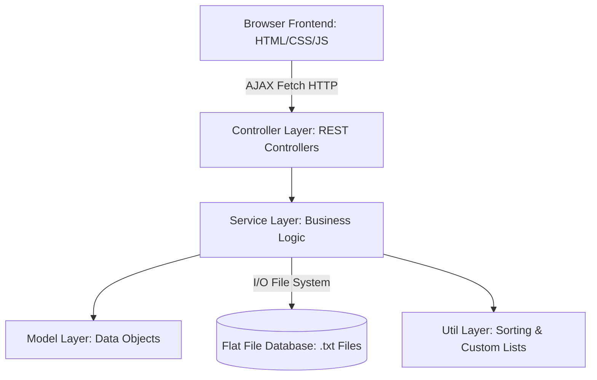

# 🚗 RentalX — Premium Vehicle Rental System

**RentalX** is a modular, high-performance web application designed to facilitate seamless vehicle rentals. Built on a modern **Spring Boot (Java 21)** backend coupled with a **Vanilla HTML5, CSS3, and ES6 JavaScript** frontend, it delivers a responsive, feature-rich platform without the overhead of heavy external database dependencies.

The application leverages a file-based persistence mechanism, custom-engineered data structures, and advanced sorting algorithms, making it an excellent showcase of Object-Oriented Programming (OOP) and Software Engineering principles.

---

## 🌟 Core Features

### 👤 Customer (User) Portal
- **Dashboard & Search:** Browse and search all available vehicles.
- **Renting & Booking:** Rent vehicles seamlessly, selecting specific rental durations.
- **Manage Bookings:** View active and historical bookings, track status, and cancel bookings.
- **Reviews & Feedback:** Leave ratings and text reviews for rented vehicles.
- **Profile Management:** Update customer profile details and manage credentials.

### 🛡️ Admin Dashboard
- **Dashboard Overview:** View system analytics, total rentals, and registered users.
- **Vehicle Management:** Full CRUD operations for vehicles (Add, Update, Delete) with image uploads.
- **Booking Administration:** Monitor and update status for all system bookings.
- **Feedback Moderation:** View and analyze reviews submitted by users.

### 🚴 Driver Hub
- **Driver Onboarding:** Drivers can register, login, and configure profiles.
- **Driver Dashboard:** Track active rental assignments and view driver-specific statistics.

---

## 🛠️ Technology Stack

### Backend
- **Core Platform:** Java 21
- **Framework:** Spring Boot 3.4.5 (Spring MVC, Web, DevTools)
- **Data Persistence:** Custom Flat-File Storage Engine (`.txt` database engine)
- **Utilities & Algorithms:**
  - **`SelectionSortUtil`:** Specialized selection sort algorithm for list arrangement.
  - **`RentedVehicleList`:** Tailored collection structure for managing rented vehicles.

### Frontend
- **Interface Structure:** Semantic HTML5
- **Styling & Aesthetics:** Modern CSS3 featuring deep HSL color themes, smooth micro-animations, glassmorphism card templates, and a fully responsive grid.
- **Dynamic Interaction:** Asynchronous JavaScript (ES6 Fetch API) for real-time CRUD communication.

---

## 🏗️ Architecture & Flow

RentalX uses a standard N-Tier Architecture with clean separation of concerns:



- **Controller Layer:** Receives client requests, processes endpoints, and handles Multipart File Uploads (vehicle images).
- **Service Layer:** Executes business rules, orchestrates CRUD operations, and manages flat-file parsing.
- **Flat-File Database:** Located in `src/main/resources/`, storing structured records for admins, bookings, drivers, reviews, users, and vehicles in text files.

---

## 🚦 Getting Started

### Prerequisites
- **Java Development Kit (JDK) 21** or higher.
- **Apache Maven 3.8+** (or use the included Maven wrapper).

### Installation & Run
1. **Clone the Repository:**
   ```bash
   git clone https://github.com/MihisaraNet/RentalX.git
   cd rentalX
   ```

2. **Run with Maven Wrapper:**
   - On Windows (PowerShell/CMD):
     ```powershell
     ./mvnw spring-boot:run
     ```
   - On macOS / Linux:
     ```bash
     chmod +x mvnw
     ./mvnw spring-boot:run
     ```

3. **Access the Application:**
   Open your preferred browser and navigate to:
   [http://localhost:8080/](http://localhost:8080/) (Entrance dashboard `index.html`).

---

## 🔗 Key REST API Endpoints

| Category | Endpoint | Method | Description |
| :--- | :--- | :--- | :--- |
| **Authentication**| `/api/users/login` | `POST` | Authenticate customer |
| | `/api/users/register` | `POST` | Register customer |
| **Vehicles** | `/api/vehicles` | `GET` | List all vehicles |
| | `/api/vehicles` | `POST` | Add a new vehicle (Admin - Multipart) |
| | `/api/vehicles/{id}` | `DELETE` | Remove a vehicle |
| **Bookings** | `/api/bookings` | `POST` | Create a new booking |
| | `/api/bookings/user/{username}` | `GET` | Retrieve bookings for a specific user |
| | `/api/bookings/{id}/status` | `PUT` | Update booking state |
| **Drivers** | `/api/drivers/register` | `POST` | Register driver |
| **Reviews** | `/api/reviews` | `POST` | Submit vehicle review |

---

## 📂 Project Structure

```text
rentalX/
├── .mvn/                  # Maven wrapper configuration
├── src/
│   ├── main/
│   │   ├── java/com/OOP/rentalX/
│   │   │   ├── controller/# Spring REST Controllers
│   │   │   ├── model/     # Domain Objects (User, Vehicle, Booking, etc.)
│   │   │   ├── service/   # Service Classes (Business logic & File DB handlers)
│   │   │   └── util/      # Custom Sort and List Utilities
│   │   └── resources/
│   │       ├── static/    # Web interface (HTML, CSS, JS, Uploaded Media)
│   │       │   ├── scripts/
│   │       │   └── uploads/
│   │       ├── *.txt      # Database stores (users, vehicles, etc.)
│   │       └── application.properties
│   └── test/              # Spring Boot test configurations
├── pom.xml                # Project dependency configuration
└── README.md              # Project documentation
```

---

## 📝 License
This project is licensed under the MIT License - see the [LICENSE](LICENSE) file for details.
