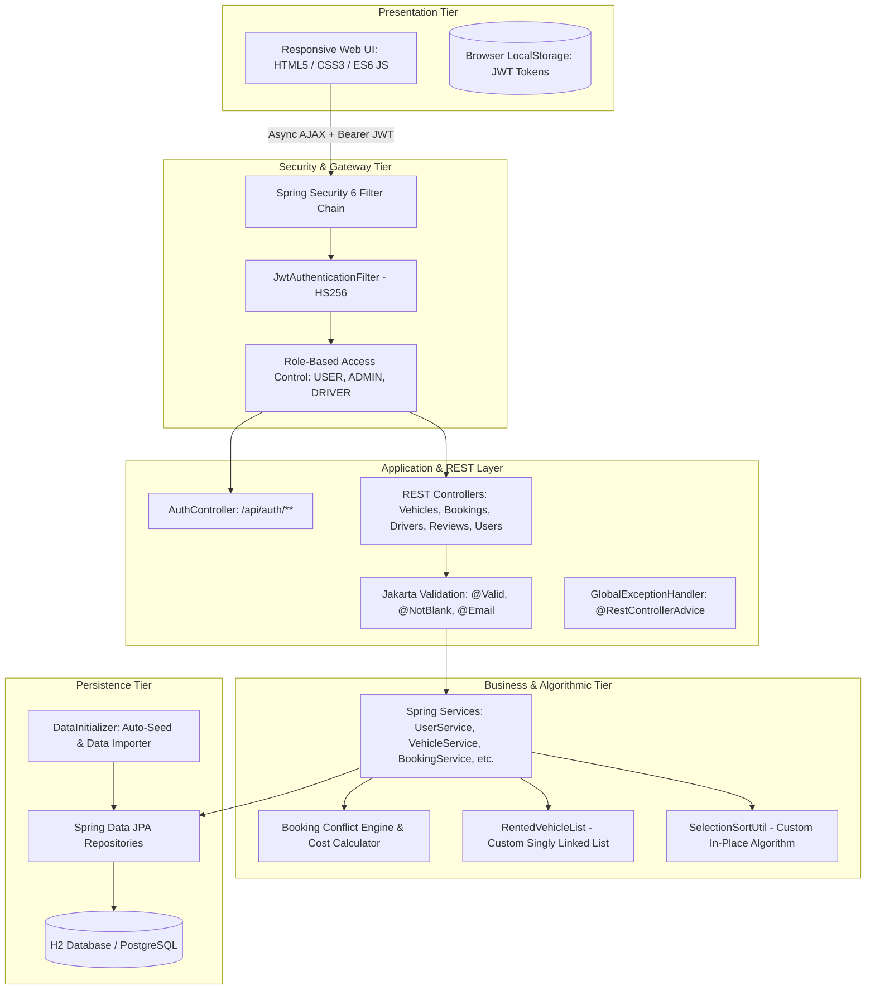

# 🚗 RentalX — Enterprise Vehicle Rental Platform

[](https://openjdk.org/)
[](https://spring.io/projects/spring-boot)
[](https://spring.io/projects/spring-security)
[](https://jwt.io/)
[](https://www.postgresql.org/)
[](https://www.docker.com/)
[](LICENSE)

**RentalX** is a modular, high-performance web application engineered for seamless vehicle rental operations. Built on a modern **Spring Boot 3.4.5 (Java 21)** backend paired with an asynchronous **HTML5, CSS3, and ES6 JavaScript** frontend, it delivers an enterprise-grade car rental platform with relational JPA persistence, stateless JWT security, real-time double-booking prevention, and containerized deployment.

The application also integrates custom data structures and custom-engineered sorting algorithms, making it an excellent showcase of advanced Object-Oriented Programming (OOP), Data Structures & Algorithms (DSA), and Software Engineering principles.

---

## 🌟 Core Features

```
┌─────────────────────────┬─────────────────────────┬─────────────────────────┐
│   👤 Customer Portal    │   🛡️ Admin Dashboard    │     🚴 Driver Hub       │
├─────────────────────────┼─────────────────────────┼─────────────────────────┤
│ • Interactive Catalog   │ • System Analytics & KPI│ • Driver Onboarding     │
│ • Real-Time Availability│ • Full Vehicle CRUD     │ • Trip Assignment Board │
│ • Conflict-Free Booking │ • Booking Moderation    │ • Profile & Credentials │
│ • Rating & Reviews      │ • User Administration   │ • Vehicle Status Sync   │
│ • Secure JWT Profile    │ • Feedback Management   │ • Driver Performance    │
└─────────────────────────┴─────────────────────────┴─────────────────────────┘
```

### 👤 Customer (User) Portal
* **Vehicle Discovery & Search:** Browse the fleet with dynamic filters (Model, Type, Availability, Price).
* **Smart Booking Engine:** Select custom rental durations with automated rental cost calculation.
* **Conflict Detection:** Automated real-time checking to prevent overlapping double-bookings.
* **Review & Rating Subsystem:** Submit verified star ratings and feedback for rented vehicles.
* **Profile Management:** Secure customer account update, authentication, and credentials management.

### 🛡️ Admin Dashboard
* **Operations Overview:** Real-time analytics on fleet inventory, registered drivers, customers, and active rentals.
* **Vehicle Fleet Management:** Full CRUD (Create, Read, Update, Delete) with image uploads and availability toggling.
* **Booking Moderation:** Approve, reject, or mark bookings as completed with instant vehicle availability synchronization.
* **Feedback Moderation:** Monitor, analyze, and moderate customer reviews.

### 🚴 Driver Hub
* **Driver Onboarding:** Dedicated driver registration, authentication, and license credential management.
* **Driver Dispatch Board:** Monitor assigned vehicles and manage active customer reservations.

---

## 🏗️ System Architecture

RentalX follows a clean **N-Tier Layered Architecture** with strict separation of concerns and stateless JWT-based API security:



---

## 🛠️ Technology Stack

| Layer | Technologies |
| :--- | :--- |
| **Backend Core** | Java 21 (LTS), Spring Boot 3.4.5, Spring MVC, Spring Actuator |
| **Security** | Spring Security 6, Stateless JWT (JJWT 0.12.6, HS256), BCrypt Password Hashing |
| **Persistence & ORM** | Spring Data JPA, Hibernate ORM, H2 Database (Dev/Test), PostgreSQL (Production) |
| **OOP & DSA Modules** | `SelectionSortUtil` (Custom in-place sort), `RentedVehicleList` (Custom Singly Linked List) |
| **Validation & Error Handling** | Jakarta Bean Validation (`@Valid`, `@NotBlank`, `@Email`), `@RestControllerAdvice` |
| **Frontend** | Semantic HTML5, CSS3 Glassmorphism UI, Vanilla ES6 JavaScript (Fetch API) |
| **DevOps & CI/CD** | Multi-Stage Dockerfile (Eclipse Temurin JRE 21 Alpine), Docker Compose, GitHub Actions |
| **Testing** | JUnit 5, Mockito, Spring Boot Test |

---

## 🔗 Key REST API Endpoints

### 🔐 Authentication (`/api/auth`)
| Method | Endpoint | Description | Access |
| :--- | :--- | :--- | :--- |
| `POST` | `/api/auth/login` | Authenticate (User, Admin, Driver) and generate JWT token | Public |
| `POST` | `/api/auth/register` | Register new account with BCrypt password hashing | Public |
| `GET` | `/api/auth/me` | Fetch authenticated user profile & active role | Authenticated |

### 🚗 Vehicle Fleet Management (`/vehicles`)
| Method | Endpoint | Description | Access |
| :--- | :--- | :--- | :--- |
| `GET` | `/vehicles/all` | List all vehicles (optional `?sortByPrice=true` via custom SelectionSort) | Public |
| `GET` | `/vehicles/available` | List only currently available vehicles | Public |
| `GET` | `/vehicles/{id}` | Get vehicle details by ID | Public |
| `GET` | `/vehicles/driver/{driverId}` | Get vehicles assigned to a specific driver | Public |
| `POST` | `/vehicles/add` | Add a new vehicle (Multipart form data with image) | Admin / Driver |
| `PUT` | `/vehicles/update/{id}` | Update existing vehicle details | Admin / Driver |
| `PUT` | `/vehicles/toggleAvailability/{id}` | Toggle vehicle availability status | Admin / Driver |
| `DELETE` | `/vehicles/delete/{id}` | Remove a vehicle from inventory | Admin |
| `GET` | `/vehicles/rented` | Fetch rented vehicles managed in the custom Linked List | Admin |

### 📅 Bookings & Reservations (`/bookings`)
| Method | Endpoint | Description | Access |
| :--- | :--- | :--- | :--- |
| `POST` | `/bookings/add` | Create a booking with conflict overlap check and cost calculation | User / Public |
| `GET` | `/bookings/all` | List all system bookings | Admin |
| `GET` | `/bookings/user/{id}` | Retrieve bookings for a specific customer | User / Admin |
| `GET` | `/bookings/driver/{id}` | Retrieve bookings assigned to a specific driver | Driver / Admin |
| `PUT` | `/bookings/approve/{id}` | Approve booking and sync vehicle availability | Admin |
| `PUT` | `/bookings/reject/{id}` | Reject booking and free vehicle availability | Admin |
| `PUT` | `/bookings/complete/{id}` | Mark rental as completed | Admin / Driver |
| `DELETE` | `/bookings/delete/{id}` | Delete booking record | Admin |

### ⭐ Reviews & Ratings (`/reviews`)
| Method | Endpoint | Description | Access |
| :--- | :--- | :--- | :--- |
| `POST` | `/reviews/add` | Submit a vehicle review with star rating (1-5) | User |
| `GET` | `/reviews/all` | Get all submitted reviews | Public |
| `GET` | `/reviews/vehicle/{vehicleId}` | Get reviews for a specific vehicle | Public |
| `GET` | `/reviews/user/{userId}` | Get reviews submitted by a specific user | User / Admin |
| `DELETE` | `/reviews/delete/{id}` | Delete a review | Admin |

---

## 🚦 Getting Started

### Prerequisites
* **Java Development Kit (JDK) 21** or higher.
* **Apache Maven 3.8+** (or use the included `./mvnw` wrapper).
* *(Optional)* **Docker & Docker Compose** for containerized deployment.

---

### Option A: Local Run (Instant Zero-Config with Embedded H2)

1. **Clone the Repository:**
   ```bash
   git clone https://github.com/MihisaraNet/RentalX.git
   cd rentalX
   ```

2. **Run using Maven Wrapper:**
   * **On Windows (PowerShell / CMD):**
     ```powershell
     ./mvnw spring-boot:run
     ```
   * **On macOS / Linux:**
     ```bash
     chmod +x mvnw
     ./mvnw spring-boot:run
     ```

3. **Access the Application:**
   * **Web Portal:** [http://localhost:8080/](http://localhost:8080/)
   * **H2 Database Console:** [http://localhost:8080/h2-console](http://localhost:8080/h2-console)  
     *(JDBC URL: `jdbc:h2:file:./data/rentalxdb` | User: `sa` | Password: `password`)*
   * **Actuator Health Check:** [http://localhost:8080/actuator/health](http://localhost:8080/actuator/health)

---

### Option B: Production Setup with Docker Compose (PostgreSQL)

```bash
docker-compose up --build -d
```
* Spawns the containerized Spring Boot application alongside a dedicated **PostgreSQL 16** database with automatic schema provisioning, persistent volumes, and healthchecks.

---

## 🧪 Running Automated Tests

Execute the automated test suite (including custom algorithm and data structure unit tests):

```bash
./mvnw test
```

* `SelectionSortUtilTest`: Validates in-place sorting logic and edge cases.
* `RentedVehicleListTest`: Validates node insertion, deletion, and query operations on the custom singly linked list.
* `BookingServiceTest`: Validates date collision detection and automated rental cost calculation.

---

## 📂 Project Structure

```text
rentalX/
├── .github/
│   └── workflows/
│       └── ci.yml                 # GitHub Actions CI/CD Pipeline
├── src/
│   ├── main/
│   │   ├── java/com/OOP/rentalX/
│   │   │   ├── config/            # Database Seeding & App Configuration
│   │   │   ├── controller/        # REST Controllers (Auth, Booking, Vehicle, etc.)
│   │   │   ├── dto/               # Request/Response DTOs & Standard ApiResponse
│   │   │   ├── exception/         # Custom Exceptions & Global Exception Handler
│   │   │   ├── model/             # JPA Entities (User, Vehicle, Booking, Admin, Driver, Review)
│   │   │   ├── repository/        # Spring Data JPA Repositories
│   │   │   ├── security/          # Spring Security 6, JWT Filter & UserDetails
│   │   │   ├── service/           # Business Logic Layer & Booking Engine
│   │   │   └── util/              # OOP Custom LinkedList & SelectionSort Algorithm
│   │   └── resources/
│   │       ├── static/            # Web interface (HTML, CSS, JS, Uploaded Media)
│   │       │   ├── scripts/       # Asynchronous ES6 JavaScript Client Scripts
│   │       │   └── uploads/       # Vehicle media and fleet images
│   │       └── application.properties # Spring configuration & datasource profiles
│   └── test/                      # JUnit 5 & Mockito automated test suite
├── Dockerfile                     # Multi-stage production container build (JRE 21 Alpine)
├── docker-compose.yml             # Container orchestration (App + PostgreSQL)
├── mvnw / mvnw.cmd                # Maven Wrapper
├── pom.xml                        # Maven Dependencies & Build Configuration
└── README.md                      # Project Documentation
```

---

## 👥 Contributors & Credits

This project was developed by group **PGNO_92** (1st Year, 2nd Semester students) at the **Sri Lanka Institute of Information Technology (SLIIT)**.

| Student ID | Name | Role / Responsibility |
| :--- | :--- | :--- |
| **IT24100710** | Ekanayaka K.E.M.C.W | Admin Module |
| **IT24100987** | Sathursikan.S | Vehicle Module |
| **IT24100618** | Inshaf M J M | Booking Module |
| **IT24100982** | Agaash N | Driver Module |
| **IT24100883** | Karanayaka K.K.I.M | Users Module |
| **IT24102920** | Balasuriya W.N.A | Review Module |

---

## 📝 License & Copyright

This project is licensed under the **MIT License** - see the [LICENSE](LICENSE) file for details.

© 2026 **Isula Mihisara** ([@MihisaraNet](https://github.com/MihisaraNet)) & Group **PGNO_92** (SLIIT). All rights reserved.
